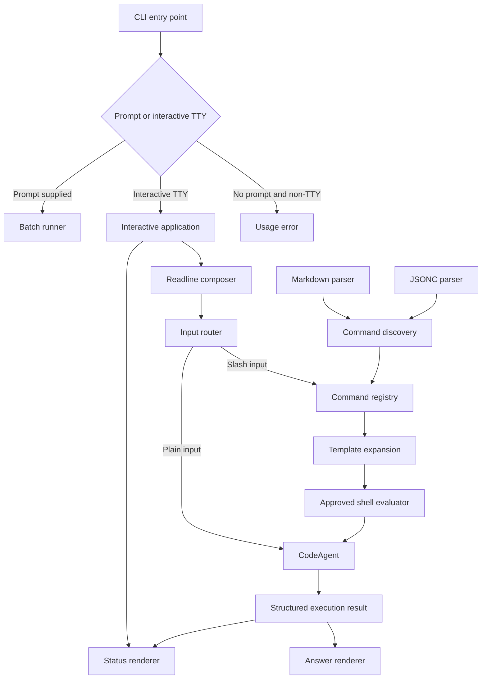

# Design — interactive-tui-custom-commands

## Context
The current CLI joins arguments into one prompt and exits after `CodeAgent.run()`. `ChatResponse` contains usage, but `CodeAgent` discards it, and providers expose no normalized identity. No command/config parser or TUI dependency exists. The implementation must preserve fast batch behavior, remain testable without a real terminal, and treat repository/global command files as untrusted input—especially when they contain shell blocks.

## Architecture



## CLI mode selection
`runCli()` remains the testable entry point. Its runtime contract gains stdin/TTY and prompt interfaces rather than reading globals directly.

- Positional arguments present: run existing batch flow.
- No arguments and input/output are TTYs: start interactive mode.
- No arguments in a non-TTY context: print usage and return status 2, avoiding a hanging CI process.
- `/exit` and EOF close cleanly; Ctrl+C cancels the active request or exits when idle.

Use Node `readline/promises` and ANSI sequences rather than a full-screen TUI framework for the first delivery. Rendering functions return strings and do not read process globals, making snapshots deterministic. ANSI/color output is disabled for non-color terminals and when `NO_COLOR` is set.

## Runtime status and cost
Extend the provider contract with immutable identity (`provider`, `model`, display names) or return a factory descriptor alongside the provider. Add `CodeAgent.runDetailed()` returning `{ content, usage, provider, model }`; retain `run()` as a compatibility wrapper returning `content`. The agent accumulates usage across every completion in a tool loop. Interactive session state aggregates usage across prompts.

A pricing catalog maps known `provider/model` identifiers to input/output prices per million tokens. Unknown or overridden models return `cost: undefined`; the header displays `N/A` rather than inventing a value. Monetary values are explicitly labeled estimates.

## Command model
Normalize every source into:

```ts
interface CustomCommand {
  readonly name: string;
  readonly template: string;
  readonly description?: string;
  readonly agent?: string;
  readonly model?: string;
  readonly subagent: boolean;
  readonly source: CommandSource;
}
```

Names are slash-free internally and reject empty segments, `.`/`..`, control characters, and path separators not introduced by nested discovery. A model override must match `provider/model` with optional `#variant`; it is passed through normalized completion options after provider compatibility validation.

`agent` is preserved for listing/diagnostics but cannot select an agent yet. `subagent: true` fails before shell execution or provider invocation.

## Discovery and precedence
Discovery is asynchronous, ignores symlinks, reads only `.md` command files, applies size limits, and reports malformed sources without exposing secrets. Global root defaults to the platform home/config directory and is injectable in tests.

Highest-to-lowest precedence:

1. Project `.koda/commands/**/*.md`
2. Project `.koda/koda.json[c]`
3. Project root `koda.json[c]`
4. Project `.opencode/commands/**/*.md`
5. Project `.opencode/opencode.json[c]`
6. Project root `opencode.json[c]`
7. Global Koda Markdown and JSON/JSONC sources
8. Global OpenCode-compatible Markdown and JSON/JSONC sources

The first definition wins across precedence levels. Duplicate names within one source level are validation errors. Results and diagnostics are lexically sorted for cross-platform determinism. Local paths are resolved under the workspace root; global paths are limited to the injected configuration roots.

## Markdown and JSONC parsing
Markdown supports optional leading `---` YAML frontmatter. Only scalar strings for `description`, `agent`, and `model`, and a boolean for `subagent`, are accepted; aliases, tags, nested values, and unknown executable fields are rejected. The remaining body, with one leading line break removed, is the prompt template.

JSONC parsing accepts comments and trailing commas without evaluating JavaScript. Files must contain an object with optional `commands`; each command requires a non-empty string `template` and may use the same metadata fields. Prototype-polluting keys are rejected.

Dependencies for YAML and JSONC parsing must be exact-pinned, vetted for at least seven days, and measured for startup impact. Parsers may be lazy-loaded only during command discovery.

## Argument expansion
Parsing preserves two representations:

- exact trimmed remainder after the slash command for `$ARGUMENTS`;
- quote-aware tokens for positional placeholders.

Single and double quotes group words and are removed; backslash escapes are supported consistently. Unterminated quotes return a user-facing parse error. Placeholder matching distinguishes `$1` from `$10`.

For all positional placeholders present, the numerically highest placeholder consumes its indexed token and every remaining token joined by spaces. Lower placeholders consume one token. Missing positions produce empty strings. Repeated placeholders reuse the same computed value. `$ARGUMENTS` uses the full argument remainder. If no full or positional placeholder exists, non-empty arguments are appended after two newlines. `@path` receives no special transformation.

## Shell blocks and trust boundary
Shell blocks use `!` followed immediately by a backtick-delimited command, for example ``!`git diff --stat` ``. Argument expansion occurs first, but shell execution never occurs implicitly.

`ShellExecutor` receives an explicit policy and approval callback. Interactive mode shows the source file and expanded command and requires confirmation. Non-interactive mode denies execution unless the caller explicitly opts in. Execution uses the workspace as `cwd`, a filtered environment, timeout, maximum stdout/stderr bytes, no stdin, and platform-appropriate shell selection. Timeout, denial, non-zero exit, and truncation become structured errors and prevent LLM submission. The command's captured stdout replaces the block; stderr is included only in diagnostics.

Because interpolated arguments can still form shell syntax, the confirmation screen highlights that expanded user input is present. This boundary mitigates accidental execution but is not a security sandbox; command sources must be treated as code.

## Testing strategy
- Pure unit tests for rendering, frontmatter, JSONC, names, tokenization, expansion, model syntax, and cost calculation.
- Temporary-directory tests for local/global discovery, precedence, nested names, symlink exclusion, malformed files, and stable ordering.
- Fake-process tests for shell approval, denial, cwd, environment filtering, timeout, output limits, and non-zero status.
- Fake readline/runtime tests for TTY mode selection, slash interception, normal prompts, `/help`, `/commands`, `/exit`, EOF, and error recovery.
- Fake providers verify accumulated multi-turn/tool-loop usage and model override forwarding without network access.

## Non-functional requirements
- Batch-mode startup regression below 20 ms relative to the current entry point on the same machine.
- Interactive header renders in under 16 ms and avoids full-screen redraws while idle.
- Command discovery handles at least 1,000 files deterministically without blocking synchronous filesystem calls.
- Command/template/config files default to a 256 KiB limit; shell output defaults to 1 MiB and 30 seconds.
- Strict TypeScript with no `any`, non-null assertions, or compiler suppressions.
- Windows and POSIX path, home-directory, quoting, shell, and ANSI behavior covered.
- Existing CLI batch behavior and SDK `CodeAgent.run()` remain backward compatible.

## Alternatives considered
- Ink/React full-screen TUI: deferred due to runtime size, cold-start overhead, and unnecessary complexity for the first interactive loop.
- Commander.js plus prompt framework: deferred because the current command surface is small and Node readline is sufficient.
- Hand-written YAML parser: rejected because YAML edge cases create unsafe ambiguity; use a restricted mature parser.
- Evaluate JSONC as JavaScript: rejected because configuration must never execute code.
- Execute shell blocks automatically: rejected because repository/global Markdown is untrusted executable content.
- Load `@path` automatically: deferred to avoid bypassing the existing file sandbox and token limits.

## Risks
- Terminal rendering differs by shell: isolate ANSI/layout logic, detect capabilities, and snapshot plain/color modes.
- Usage/cost differs by provider: aggregate normalized usage and display unknown pricing as `N/A`.
- Precedence surprises users: publish source information in `/commands` and diagnostics.
- Shell interpolation enables injection: require approval after expansion, apply limits, and deny unattended execution by default.
- Global commands can be malicious: display source and apply the same approval boundary regardless of precedence.
- `subagent` metadata implies unsupported behavior: fail clearly before side effects and document the limitation.
