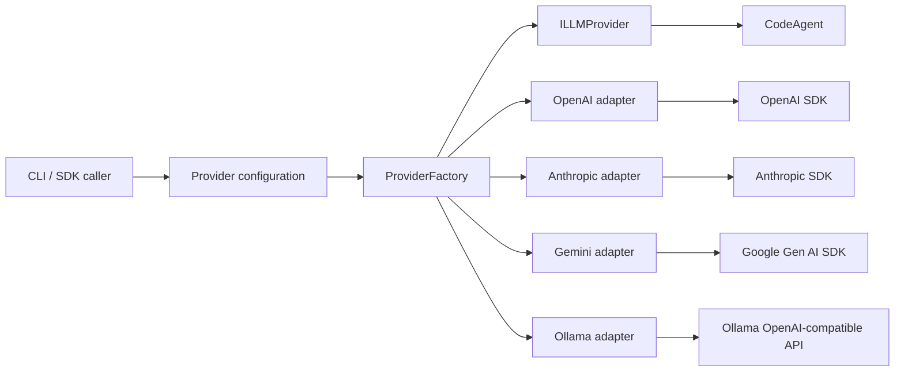

# Design — multi-provider-ai-abstraction

## Context
The current agent already receives `ILLMProvider`, but that interface has only `complete()`, the OpenAI adapter is at the provider root, and the CLI reads `OPENAI_API_KEY` and constructs OpenAI directly. The design must add providers without pushing vendor-specific message shapes, credentials, or branching into the core.

## Architecture

### Normalized contract
`base.provider.ts` remains the only contract consumed by agent/core code. It introduces:

- `ContentPart` as a discriminated union for text and image inputs while accepting legacy string content during migration;
- `CompletionOptions` with model, temperature, maximum output tokens, and normalized tools;
- `StreamEvent` as a discriminated union for text deltas, tool-call deltas, completed tool calls, usage, completion, and failure;
- `ProviderCapabilities` and `supportsTools()` so unsupported features fail before a request;
- `ILLMProvider.complete()` and `ILLMProvider.stream()` returning normalized values only.

Tool arguments remain serialized JSON at the boundary to preserve the existing registry and avoid provider-dependent object semantics. Adapters must preserve tool call IDs across assistant and tool messages.

### Adapters
Adapters move under `src/providers/adapters/`. Each adapter owns request mapping, response normalization, stream assembly, vendor error conversion, default model selection, and SDK client injection for tests.

- OpenAI maps chat completion messages and native function calls, retaining existing behavior.
- Anthropic separates system content, maps tool definitions to `input_schema`, maps assistant calls to `tool_use`, maps tool observations to `tool_result`, and normalizes content-block streams.
- Gemini maps content/parts, function declarations and calls, and image parts. Stable synthetic tool-call IDs are generated only when Gemini does not provide IDs and are retained in normalized history.
- Ollama reuses OpenAI-compatible protocol semantics but has a dedicated adapter/configuration identity, defaults to `http://127.0.0.1:11434/v1`, and never requires an API key.

No adapter imports another adapter's vendor SDK types. Shared provider-neutral helpers may live under `src/providers/internal/`.

### Factory and configuration
`ProviderFactory.create(config)` accepts a discriminated `ProviderConfig` union. `ProviderFactory.fromEnvironment(env)` parses environment variables into that union and then delegates to `create`.

Supported names are `openai`, `anthropic`, `gemini`, and `ollama`. `KODA_PROVIDER` is canonical; `OPENCODE_PROVIDER` is accepted only when the canonical variable is absent. The factory validates required keys (`OPENAI_API_KEY`, `ANTHROPIC_API_KEY`, `GEMINI_API_KEY`), optional model variables, and Ollama base URL before constructing an adapter. Errors name the missing variable but never include secret values.

Configuration precedence is explicit config > provider-specific environment model > adapter default. There is no automatic provider fallback because silently switching providers changes cost, privacy, and model behavior.

### Agent and CLI integration
`CodeAgent` keeps constructor injection and calls only normalized methods. Existing non-streaming `run()` remains behaviorally compatible. Contract tests run the same read-file interaction against fake normalized providers and adapter mapping tests.

The CLI replaces direct OpenAI construction with `ProviderFactory.fromEnvironment(runtime.env)`. Missing/invalid provider configuration is reported through the existing graceful error path.

### Dependency policy
Add official Anthropic and Google Gen AI SDKs only after checking versions are at least seven days old. Ollama uses the existing OpenAI-compatible client rather than another runtime SDK. Dependencies are exact-pinned and adapter imports are lazy where practical so selecting one provider does not initialize all SDKs.

## Compatibility
- Existing string `ChatMessage.content`, OpenAI defaults, and `CodeAgent.run()` remain supported.
- Existing SDK exports are re-exported from their new locations.
- `OPENAI_API_KEY` with no provider variable continues selecting OpenAI.
- New provider and stream types are additive unless compilation reveals an unavoidable contract break, which must be documented and tested.

## Non-functional requirements
- Strict TypeScript with zero `any`, non-null assertions, or compiler suppressions.
- No credentials in logs, errors, normalized messages, or persisted files.
- Provider selection adds no network calls and should complete in under 25 ms excluding dynamic module loading.
- Streaming yields events as received and honors consumer cancellation through `AbortSignal`.
- Adapter tests are deterministic, offline, and validate malformed/empty vendor responses.
- Bundle/startup impact is limited by lazy adapter imports and no Ollama-specific dependency.

## Alternatives considered
- A single adapter with provider conditionals: rejected because vendor branches would grow combinatorially and violate the Adapter pattern.
- LangChain or another orchestration framework: rejected because it adds substantial runtime weight and duplicates the small contract Koda needs.
- Automatic fallback between vendors: rejected because it can unexpectedly change cost, data residency, and semantics.
- Treat Ollama as `openai` configuration only: rejected because a distinct identity improves configuration validation, capabilities, telemetry, and user-facing errors while still reusing protocol mapping internally.
- Provider-specific streaming return types: rejected because callers would need vendor branching.

## Risks and mitigations
- Tool streaming differs across vendors: normalize incremental events and test final call assembly with recorded-shaped fixtures.
- Gemini tool IDs differ from OpenAI/Anthropic: generate deterministic IDs when absent and preserve them through subsequent tool results.
- Multimodal expansion destabilizes existing strings: use a backward-compatible union and central normalization helpers.
- SDK updates alter payload types: exact-pin vetted versions and isolate them in adapters.
- Local Ollama models may not support tools: expose capabilities and fail clearly before tool-dependent execution.
- Four providers enlarge test scope: define reusable adapter conformance tests and mock SDK transports rather than duplicating behavioral suites.
