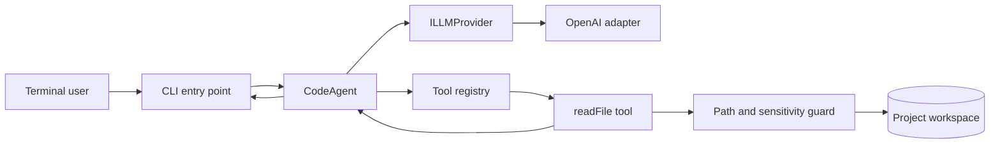

# Design — mvp-read-file-agent-loop

## Context
The first delivery must prove the smallest useful agent cycle: a terminal prompt causes an LLM to request local file content, the application reads an allowed file, and the LLM returns an answer grounded in that observation. The codebase is an empty strict-TypeScript shell, so the design must introduce clear boundaries without building the full roadmap prematurely.

Constraints:

- No `any`, non-null assertions, or unchecked tool arguments.
- API keys are accepted only through `OPENAI_API_KEY` and are never persisted or logged.
- File access is read-only and confined to the workspace root.
- Tests must not call a real provider.
- Runtime dependencies must remain minimal; OpenAI is the only required provider SDK for this slice.

## Architecture

### Provider contract
`src/providers/base.provider.ts` defines normalized immutable types and an `ILLMProvider.complete` method. Assistant responses expose either text, normalized tool calls, or both. The core loop never imports OpenAI SDK types.

`src/providers/openai.provider.ts` owns translation to and from the OpenAI chat-completions API. It uses a configurable model with `gpt-4o-mini` as the MVP default and enables automatic tool selection only when tools are supplied.

### Read-file boundary
`src/utils/security.ts` resolves a user-supplied relative path against an injected workspace root. Containment is checked using `path.relative`, rejecting absolute inputs, parent traversal, paths whose relative result escapes the root, and sensitive path segments or filenames. This avoids the unsafe string-prefix check where sibling paths can share a prefix and accounts for Windows path semantics.

`src/tools/file-system/read-file.tool.ts` accepts `{ filePath: string }`, invokes the guard, and reads UTF-8 content asynchronously. Operational failures become typed tool errors; no raw secrets or stack traces are returned to the model by default.

### Registry and validation
`src/tools/registry.ts` publishes the normalized `readFile` schema and dispatches only exact registered names. Parsed JSON starts as `unknown`; a type guard validates that it is an object containing only a non-empty string `filePath`. Malformed arguments and unknown tools return controlled observations rather than causing an unhandled exception.

### Agent loop
`src/core/agent.ts` builds the system and user messages, calls the provider, and repeats while tool calls are present:

1. Append the assistant response to history.
2. Execute each requested tool through the registry.
3. Append one tool observation per call using its call ID.
4. Request the next completion.
5. Stop when text is returned without tool calls or when the configured iteration limit is reached.

The loop defaults to a small finite limit to prevent runaway requests. Exceeding it produces a typed agent error. Supporting all tool calls in a response avoids silently dropping model intent while retaining a simple sequential implementation.

### CLI
`src/cli/index.ts` joins positional arguments into a prompt, validates the prompt and `OPENAI_API_KEY`, constructs the provider and agent, and writes the final answer. Lifecycle output is concise and does not expose tool results or credentials. Errors are converted to actionable messages and a non-zero exit code. No dotenv dependency is required; environment injection remains the caller's responsibility.

## Testing strategy
Use the existing project test runner, or establish Node's lightweight test runner if none exists. Inject a fake `ILLMProvider` into `CodeAgent` to verify message sequencing deterministically. Use temporary directories for file tests and cover both POSIX-style traversal input and platform-native containment behavior. OpenAI translation is tested with a mocked client boundary rather than real network access.

## Non-functional requirements
- CLI startup code should avoid eagerly importing optional UI packages; the MVP target is under 100 ms excluding provider/network time, measured as a follow-up benchmark rather than a hard cross-platform test.
- File I/O is asynchronous and memory is bounded by a configurable maximum file size, initially 1 MiB.
- The loop has a configurable maximum iteration count, initially 5.
- Public internal contracts remain provider-neutral so adding another adapter does not require changing agent orchestration.
- The CLI must support current maintained Node.js LTS releases and both Windows and POSIX path semantics.

## Alternatives considered
- Directly use OpenAI SDK types in the agent: rejected because it couples orchestration and tools to one vendor and conflicts with the provider-agnostic roadmap.
- Implement exactly one `if (readFileTool)` branch: rejected because a small registry creates deterministic dispatch and enables future tools without changing the loop.
- Check containment with `absolutePath.startsWith(root)`: rejected because sibling prefixes and case/path-separator behavior can bypass or incorrectly trigger the check.
- Add Commander.js and dotenv now: deferred because positional prompt parsing and environment variables are sufficient to prove the MVP, reducing startup and dependency cost.
- Return file-system error strings from the tool: rejected in favor of typed failures converted to sanitized observations at the agent boundary.

## Risks
- Model emits invalid JSON or an unknown tool name: validate `unknown` input and return a controlled tool observation so the model can self-correct.
- Symlinks inside the workspace resolve outside it: compare real paths for existing targets before reading and reject targets outside the real workspace root.
- Large files exhaust context or memory: enforce the initial 1 MiB limit before reading.
- Prompt injection inside file content influences the model: system instructions identify tool output as untrusted project data; write and command tools remain unavailable.
- Provider behavior or SDK types change: isolate all vendor translation in the adapter and pin a vetted dependency version.
- Network/API failures degrade CLI UX: normalize provider failures and print a concise message, with raw details reserved for a future verbose mode.
