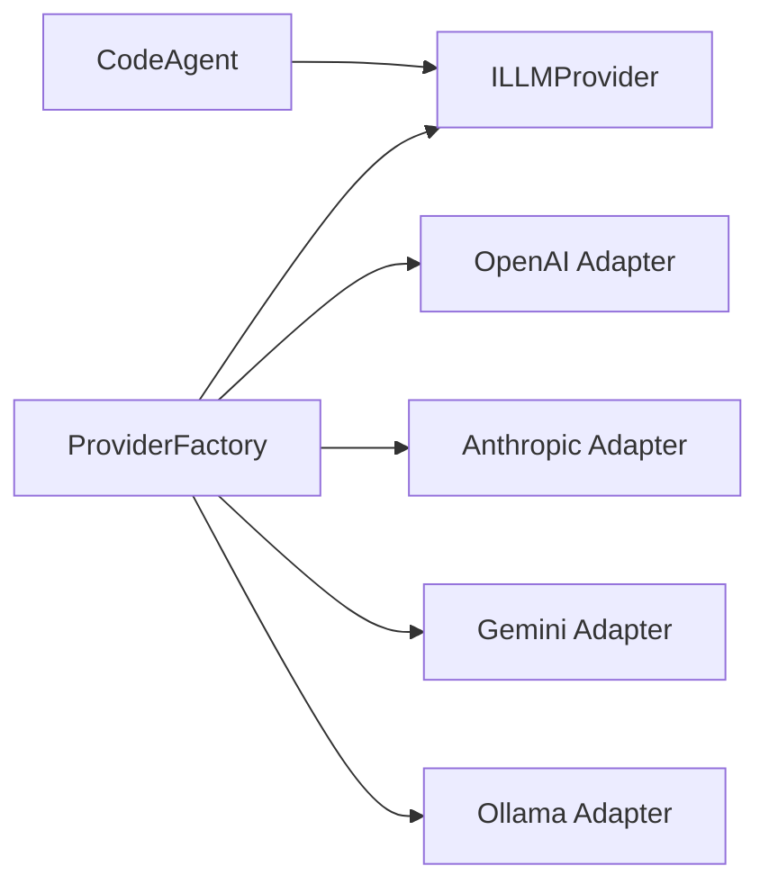

# Specification & Roadmap: Multi-Provider AI Abstraction Layer

## Objective
Implement a pluggable provider layer that lets Koda switch among OpenAI, Anthropic, Google Gemini, and local Ollama models without changing the core agent loop.

## Architecture

- **Strategy:** `ILLMProvider` defines normalized completion, streaming, and capability behavior.
- **Adapter:** each vendor adapter owns SDK payload conversion and error normalization.
- **Factory:** explicit configuration or environment variables select and validate an adapter.

## Provider configuration

| Provider | Selector | Required configuration | Optional configuration |
| --- | --- | --- | --- |
| OpenAI | `KODA_PROVIDER=openai` | `OPENAI_API_KEY` | model |
| Anthropic | `KODA_PROVIDER=anthropic` | `ANTHROPIC_API_KEY` | model |
| Gemini | `KODA_PROVIDER=gemini` | `GEMINI_API_KEY` | model |
| Ollama | `KODA_PROVIDER=ollama` | none | base URL, model |

`OPENCODE_PROVIDER` is a compatibility alias. `KODA_PROVIDER` takes precedence. Secrets remain environment-only and must never be logged or persisted.

## Roadmap

### Phase 1 — Unified contracts
- Extend `ChatMessage`, tool schemas, completion options, and responses.
- Add normalized multimodal content, streaming events, provider capabilities, and cancellation.
- Require `complete()`, `stream()`, and `supportsTools()`.

### Phase 2 — Vendor adapters
- Move and extend the OpenAI adapter.
- Add Anthropic message/tool block mapping.
- Add Gemini content/function mapping.
- Add Ollama through its OpenAI-compatible local endpoint.

### Phase 3 — Factory and configuration
- Add discriminated provider configuration.
- Add explicit and environment-driven factory creation.
- Validate credentials, URLs, models, and unsupported capabilities with secret-safe errors.

### Phase 4 — Agent and CLI integration
- Preserve `CodeAgent` dependency injection and vendor neutrality.
- Replace direct OpenAI construction in the CLI with the factory.
- Add offline adapter, conformance, CLI, and tool-loop tests.

## Capabilities
All providers expose normalized text completion and streaming. OpenAI and Anthropic must support the existing tool loop. Gemini supports function calling and normalized text/image inputs. Ollama tool support depends on the selected local model and is exposed through capability checks.

## Definition of done
- Changing only provider environment configuration selects a backend.
- OpenAI and Anthropic execute identical normalized tool-call flows.
- No vendor SDK type escapes `src/providers/adapters/`.
- Every adapter has offline request, response, stream, tool, and error mapping tests.
- Missing credentials and unsupported capabilities produce actionable errors without exposing secrets.

## Dependency and smoke-test policy

The implementation exact-pins `@anthropic-ai/sdk` 0.68.0 and `@google/genai` 1.30.0. Ollama reuses the exact-pinned OpenAI client and adds no provider-specific dependency. Automated smoke tests inject mocked SDK clients/transports and never require credentials or network access. Optional live checks can be run by setting the selected provider and its API key locally; credentials and responses must not be committed.

## Non-functional requirements
- Provider selection under 25 ms excluding dynamic module loading and network calls.
- Exact-pinned, vetted dependencies and no Ollama-specific runtime dependency.
- Streaming propagates events incrementally and honors cancellation.
- Strict TypeScript with no `any` or compiler suppression.
- Backward-compatible OpenAI defaults and public exports.
